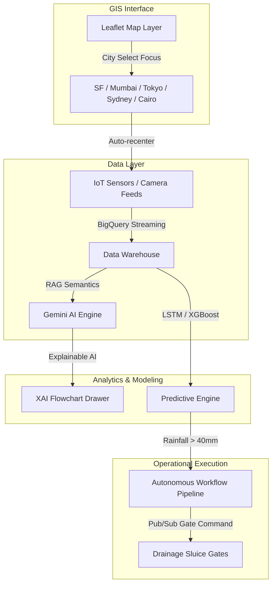

# 🏙️ Metropolis AI - Smart City Command Center

[](https://storage.googleapis.com/metropolis-ai-536438030825/index.html)
[](https://opensource.org/licenses/MIT)
[](https://developer.mozilla.org/en-US/docs/Web/JavaScript)
[](https://leafletjs.com/)

An advanced, responsive, and glassmorphic **Decision Intelligence Command Center** web application. It integrates real-time IoT telemetry, predictive sandboxes, GIS temporal satellite overlays, multimodal vision models, citizen feedback ledgers, and cooperative multi-agent logs into a single command control deck.

---

## ☁️ Live Deployment

The application is deployed on Google Cloud Platform:
👉 **[Live Website Link](https://storage.googleapis.com/metropolis-ai-536438030825/index.html)**

---

## 🎨 System Architecture & Interface Design

The command center implements a high-fidelity space-dark aesthetic utilizing translucent card panels, glowing alerts, micro-animations, and dynamic responsive sidebars.



---

## 🚀 Key Features

### 1. 📊 Overview Dashboard (Looker + BigQuery)
* Real-time metrics tracking Air Quality Index (AQI), Water Reservoirs, Average Transit Velocity, and Grid Power Load.
* Dynamic dual y-axis Chart.js line graphs displaying resource cycles.
* **Executive PDF Report Generator**: Programmatically collects current live dashboard configurations and formats them into a formal municipal directive.

### 2. 🔮 Predictive Engine Sandbox
* Adjust environmental modifiers (Rainfall, Temperature offset, Holidays) to inspect forecast deviations.
* Interactive comparisons between **LSTM Recurrent Nodes** (smooth forecasts) and **XGBoost Decision Trees** (step-wise estimates).
* Integrated Explainable AI (XAI) feature importance ranking bars that adjust live.

### 3. 📡 Satellite & Geo-Intelligence (Leaflet GIS)
* Dark CartoDB GIS tiles supporting zoom scopes from local streets to full global overviews.
* Toggles for multispectral indexes: **Flood Hazard Risk** (blue), **Crop NDVI** (green), and **Urban Heat Islands** (red).
* Playable timeline loop (2020 - 2026) demonstrating land-surface change models.
* **Focus City Selector**: Fly-to navigation centering map layers and custom pulsing IoT markers around major global capitals.

### 4. 🖼️ Multimodal AI Analysis Inspector
* **Vision AI**: Select road pothole or garbage samples to view overlay bounding boxes with confidence intervals.
* **Video AI**: Simulates traffic pedestrian box tracking on live CCTV camera feeds, updating counts every 4 seconds.
* **Voice NLP**: Synthesizes citizen emergency voice calls, prints running transcripts, and runs NLP entity extraction for category, location, and severity tags.

### 5. 🤖 Gemini Conversational Decision Assistant
* Sidebar query terminal with preset prompts for travel times, water shortages, and risk analysis.
* Interlinked with the map focus city to offer localized context.
* Detailed **Explainable AI (XAI)** drawer containing confidence scores, dataset lineages, and decision flow charts.

### 6. ⚙️ Autonomous Operations Pipelines
* Node pipeline workflow executing rainfall sentinel warnings, Pub/Sub SMS alerts, and sluice gate triggers.
* Automatically fires from the Predictive Engine if forecasted rain exceeds 40mm.

### 7. 🧑‍🤝‍🧑 Community Hub & Policy Generator
* Public citizen logging boards with upvoting systems that dynamically re-sort cards.
* AI Policy Generator drafts legislative directives based on the most upvoted civic concerns.

### 8. 🚦 ADK Multi-Agent Cooperation Terminal
* Terminal logging communication logs between **Traffic**, **Environment**, **Health**, and **Utility** agents working collaboratively to resolve city issues.

---

## 🛠️ Technology Stack

* **Structure**: Semantic HTML5 markup
* **Styling**: Modern, custom CSS3 properties (Glassmorphism, Neon glows, CSS filter hue-shifts)
* **Logic**: Vanilla ES6 JavaScript
* **Libraries**:
  * **Chart.js** (Line & bar forecasting models)
  * **Leaflet.js** (GIS interactive mapping layers)
  * **FontAwesome v6** (Interface vector symbols)

---

## 💻 Running Locally

### Prerequisites
* A web browser (Google Chrome, Microsoft Edge, Firefox, or Safari).
* Git installed.

### Steps
1. Clone the repository:
   ```bash
   git clone https://github.com/devarkarrenika-pixel/Metropolis-AI.git
   ```
2. Navigate to the project directory:
   ```bash
   cd Metropolis-AI
   ```
3. Open `index.html` in your browser:
   * **Windows**:
     ```powershell
     Start-Process "index.html"
     ```
   * **macOS**:
     ```bash
     open index.html
     ```
   * **Linux**:
     ```bash
     xdg-open index.html
     ```
