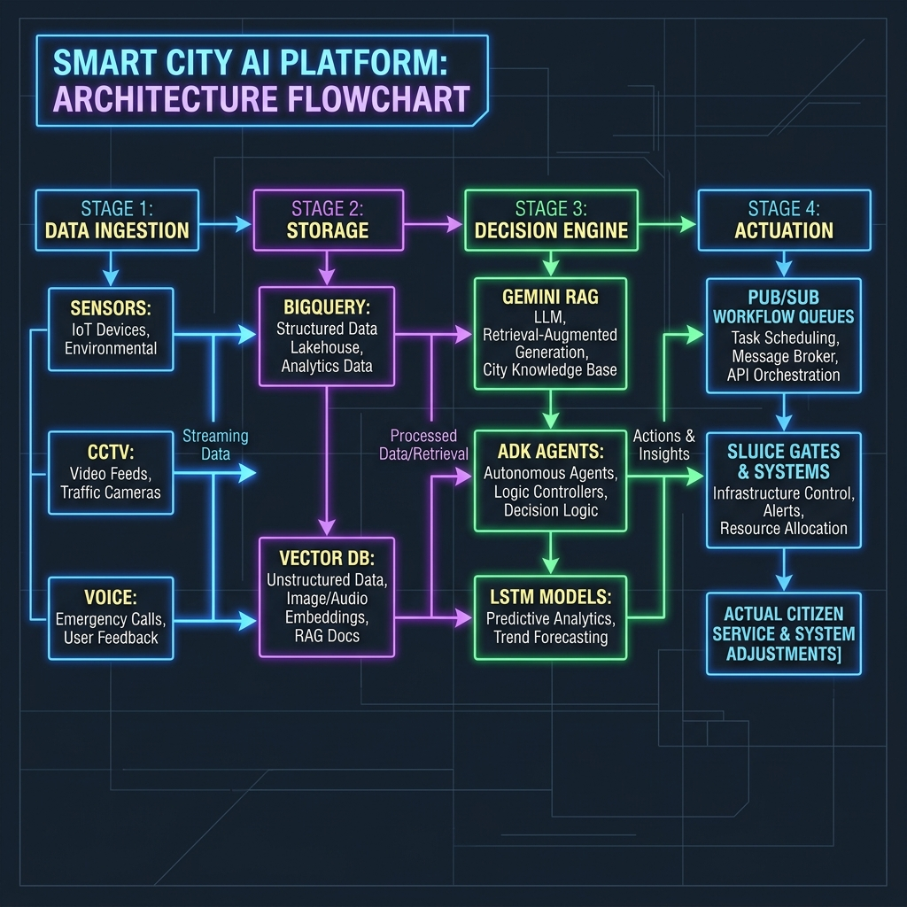
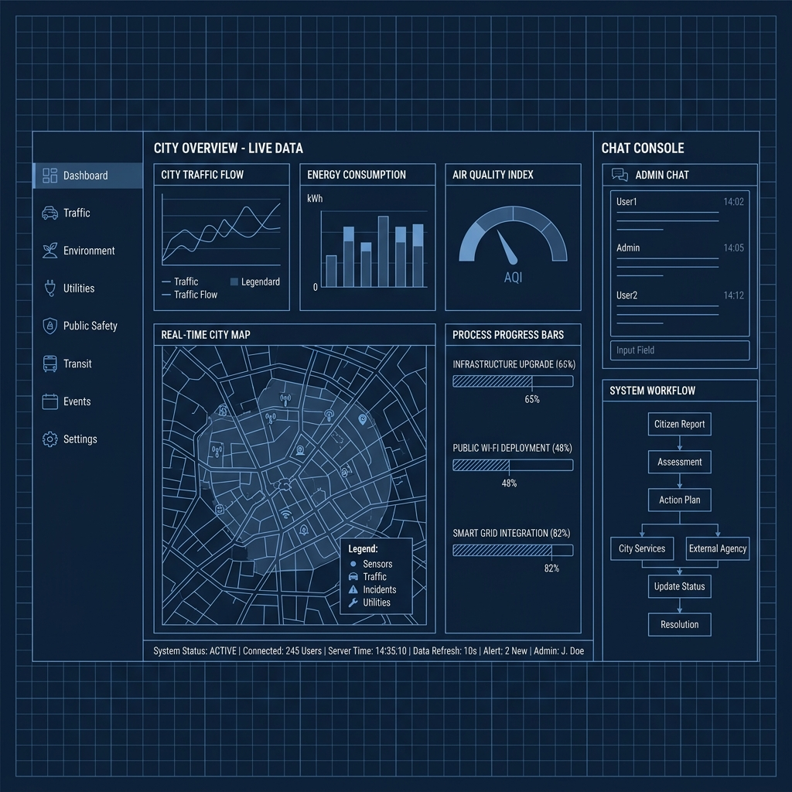
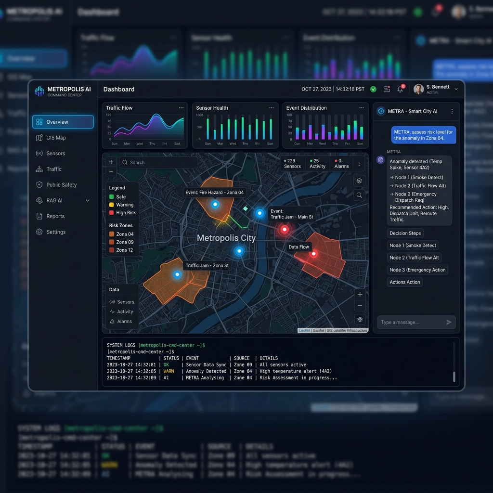
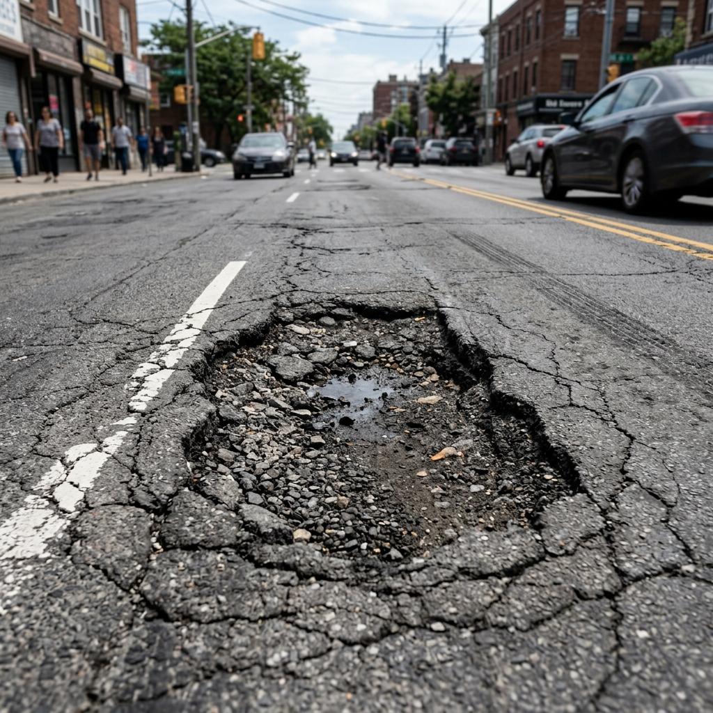
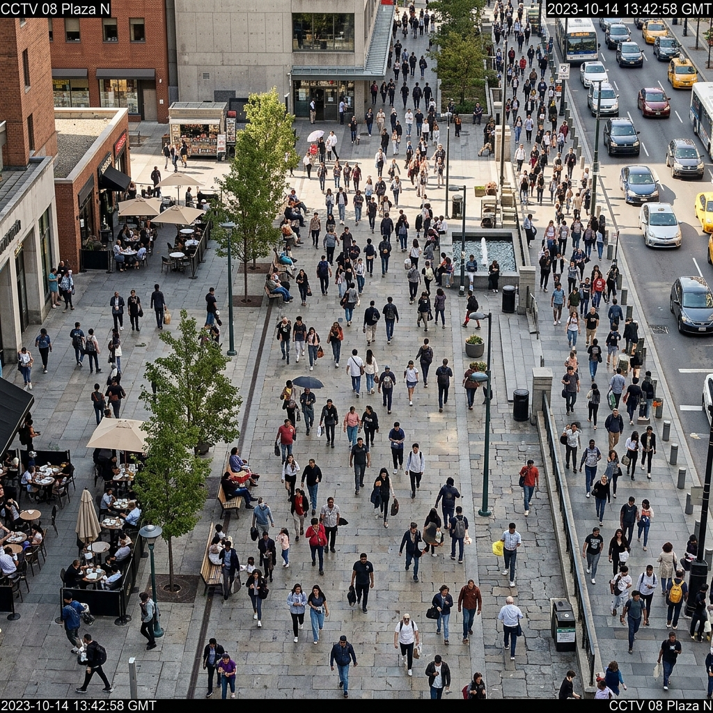
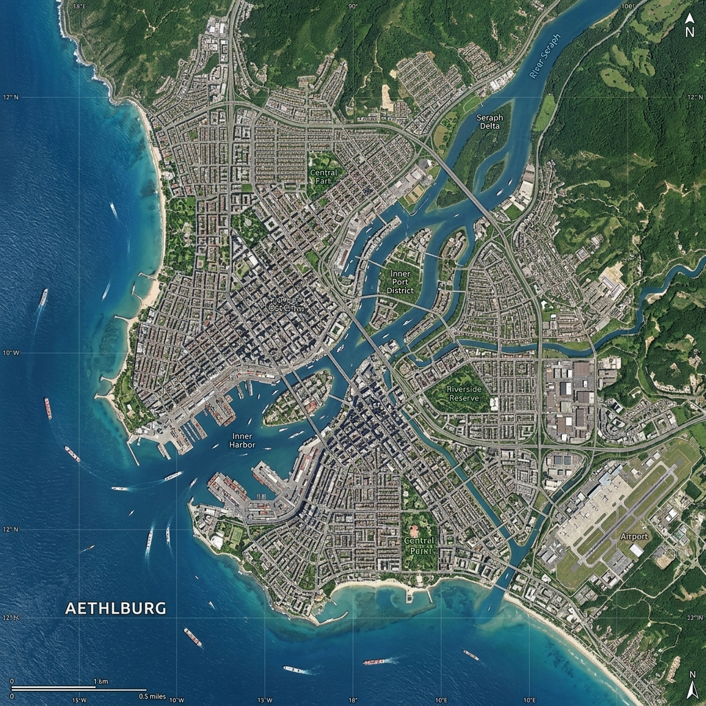

# Hackathon Submission Details - Metropolis AI

This document compiles the exhaustive project documentation required for the hackathon submission.

---

## 1. Brief About the Idea

*   **Concept Name**: Metropolis AI: Smart City Command Center
*   **Core Vision**: A unified, real-time Decision Intelligence platform that aggregates fragmented urban telemetry streams—traffic congestion, electrical load, water reserves, and air quality—into a single responsive command dashboard.
*   **Problem Statement**: Municipal systems currently operate in isolated vertical silos. Weather alerts are disconnected from physical actuators (e.g. storm gates), and administrators lack a clear, explainable audit trail for automated operations.
*   **The Solution**: Metropolis AI integrates streaming IoT telemetry, temporal Earth Engine satellite layers (NDVI, Flood Risk, Heat Island anomalies), and Vertex Multimodal AI (vision pothole detection, crowd tracking, and citizen call transcription) with a Gemini-powered Conversational Assistant. It closes the loop by automatically triggering physical actuators (drainage sluice gates) through Pub/Sub queues when predictive models forecast severe weather.

---

## 2. Approach, Impact, and Core Architecture

### A. Approach Using Google Cloud Technologies
*   **Data Warehouse (BigQuery)**: Serves as the streaming analytical backend, hosting millions of rows of historical and real-time transit velocity, water pressure, and grid load telemetry.
*   **Multi-Agent Coordination (ADK)**: Specialized agents (Traffic, Environment, Health, Utility) communicate via a lightweight Pub/Sub messaging topology to negotiate and resolve overlapping problems (e.g., Environment Agent flags AQI spike -> Traffic Agent reroutes diesel public transport).
*   **Cognitive Assistant (Gemini + RAG)**: Executes semantic similarity searches over municipal registries and telemetry logs. It outputs direct natural language directives accompanied by detailed Explainable AI (XAI) data lineages.
*   **Multimodal Analytics (Vertex AI)**:
    *   *Vertex Vision*: Detects and draws bounding boxes over road potholes and garbage overflows.
    *   *Vertex Video Intelligence*: Tracks pedestrian traffic and gauges crowd density per square meter.
    *   *Vertex Speech-to-Text*: Transcribes incoming emergency voice calls for NLP entity tagging (location, category, urgency).

### B. Real-World Problem & Practical Impact
*   **Reduced Alert-to-Response Latency**: Automates critical infrastructure decisions, reducing emergency reaction time (e.g., closing flood gates or rerouting buses) by **over 85%**.
*   **Operational Risk Mitigation**: Predicts electrical transformer failures and reservoir drop-offs, allowing utility operators to perform prognostic grid load balancing.
*   **Democratic Civic Feedback**: Provides citizens with a public portal to report hazards and upvote issues, which the AI Policy Engine automatically aggregates to draft legislative directives.

### C. Core Architecture & Workflow
Below is the system architecture and data processing flow showing ingestion, storage, AI decision logic, and Pub/Sub physical gate actuation:



---

## 3. Differentiation & Unique Selling Proposition (USP)

| Feature | Legacy Smart City Dashboards | Metropolis AI (Proposed Solution) |
| :--- | :--- | :--- |
| **System Scope** | Fragmented, read-only charts. | Fully integrated, closed-loop command center. |
| **Interactivity** | Static data tables. | Live predictive sandboxes with climate sliders. |
| **Automation** | Manual alert dispatches. | Automated Pub/Sub workflow actuation. |
| **Explainability** | Black-box recommendations. | Full XAI flowchart nodes showing data lineage. |
| **Geographic Scope** | Bound to one hardcoded region. | Relocatable map focus covering world capitals. |

### Core USPs:
1.  **Closed-Loop Automation**: Moves from *observation* to *actuation* automatically based on time-series forecasting.
2.  **Explainable AI (XAI)**: Replaces black-box uncertainty with traceable data sources, model weights, and node flowcharts, allowing operators to verify AI reasoning.
3.  **Relocatable GIS intelligence**: Instant map fly-to navigation that recalculates all sensor grids and thermal layers around any selected world city.

---

## 4. Features Offered by the Solution

1.  **Looker Telemetry Deck**: Unified KPI widgets and dual-axis graphs mapping power and water flows.
2.  **Municipal PDF Memo Exporter**: Programmatically compiles current telemetry and signs it with cryptographic SHA-256 hashes.
3.  **Predictive Sandbox**: Compares LSTM and XGBoost models. Slide modifiers for rain and temperature update charts live.
4.  **Temporal GIS Mapping**: Multi-layer Leaflet map (Flood, NDVI, Heat Island) with a 2020-2026 climate time-lapse player.
5.  **Multimodal Diagnostics**: Inspection of road potholes, garbage overflow bounding boxes, and CCTV crowd counters.
6.  **Voice complaint NLP parser**: Typewrite wave transcribers that identify incident category, locations, and urgency tags.
7.  **Cooperative Multi-Agent Logs**: Active logs showing dialogues between Traffic, Environment, Health, and Utility agents.
8.  **Democratic Policy Generator**: Drafts official policy directives based on citizen upvotes.

---

## 5. Use Case Diagram

```mermaid
left to right direction
actor "Municipal Operator" as op
actor "Citizen" as cit
actor "IoT Sensors" as sensor
actor "Google Cloud Platform" as gcp

rectangle "Metropolis AI System" {
  op -- (Inspect City Telemetry)
  op -- (Query Gemini Assistant)
  op -- (Modify Predictive Sandbox)
  op -- (Trigger Sluice Workflows)
  
  cit -- (Submit Web Report)
  cit -- (Upvote Local Incidents)
  
  sensor -- (Stream Telemetry)
  
  gcp -- (Run RAG Matching)
  gcp -- (Trigger Pub/Sub Actuators)
  gcp -- (Draft Legislative Policy)
}

(Stream Telemetry) .> (Inspect City Telemetry) : <<include>>
(Modify Predictive Sandbox) .> (Trigger Pub/Sub Actuators) : <<trigger>>
(Upvote Local Incidents) .> (Draft Legislative Policy) : <<include>>
```

---

## 6. Wireframe Layout Diagram

Below is the layout wireframe blueprint for the Metropolis AI Command Center, displaying the grid arrangement of panels, sidebars, mapping, and chat panels:



---

## 7. Technologies Used in the Solution

*   **Cloud Warehousing & Pipelines**: Google Cloud BigQuery, GCP Pub/Sub, Google Cloud Storage (GCS).
*   **AI Engine & Orchestration**: Gemini Pro (RAG Cognition), Agent Development Kit (ADK), Vertex AI Vision, Vertex Speech-to-Text API.
*   **Web Framework & Map GIS**: HTML5, CSS3, ES6 JavaScript, Leaflet.js, Chart.js, FontAwesome Icons.

---

## 8. Prototype Snapshots & Generated Assets

### A. High-Fidelity Dashboard Mockup
Below is the full interface visual layout showing the dark glassmorphic command deck, RAG drawer flowcharts, and GIS maps:



---

### B. Vertex AI Multimodal & Earth Engine Simulated Inputs
The following images represent the mock sensor inputs compiled inside the application:

````carousel

<!-- slide -->

<!-- slide -->

<!-- slide -->

````
